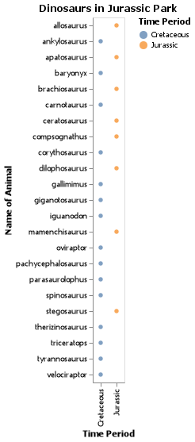
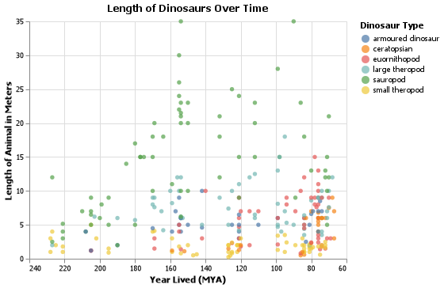

# Overview

In this project, I wanted to look at how dinosaurs were viewed in the public lens and what some underlying influences could be driving that perception. For this analysis, I used python with the numpy, pandas, and altair libraries. I chose these tools for both their power and flexibility, as well as their relative ease of use.

[Explaination Video](https://youtu.be/qPp3uaIDnGA)

# Data Analysis Results

### Question 1: What is the influence of _Jurassic Park_?

Because most public interpretation of dinosaurs comes from _Jurassic Park_, either directly or through another medium, my first question was what kind of representation the movies provide of dinosauria as a whole.

I took the all dinosaurs that appear in the movies (any movie), and wanted to see which of the three Mesezoic periods they lived in. As you can see, 'Jurassic' Park is a bit of a misnomer as most of the dinosaurs com from the Cretaceous period. Taking a closer look at the list, nearly all of the Jurassic era animals play very minor roles in the films, with notable exceptions being Brachiosaurus and Dilophosaurus. All of the main characters, so to speak, are from the Cretaceous period, specifically the late Cretacous. This skews public understanding of dinosaurs, allowing a period of a few million years act as representative of the Mesezoic as a whole.

### Question 2: How does size play into perception?

As most Texans will tell you, bigger is better, and in the case of dinosaur notoriety, this certainly the case. Most of the well known dinosaurs are not only from the Cretaceous period, but are typically larger than their contemperaries. However, I think that this is mostly due to the fact that there were more large dinosaurs at the end of the Mesezoic, especially therapods.

While sauropods gained their size early in the Jurassic, most other dinosaurs didn't get above 10ft until the Cretaceous. Another factor to consider is the increased number of dinosaurs that lived during the Cretaceous. While this dataset is by no means conprehensive (having only 309 species), it does list some of the most popular dinosaurs, further demonstrating that public knowledge is most heavily concentrated in the Mid-Late Cretaceous.

# Development Environment

This analysis was done with the interactive python kernal in VS Code, using the pandas, numpy, and altair libraries

# Useful Websites

* [Dataset](https://www.kaggle.com/kjanjua/jurassic-park-the-exhaustive-dinosaur-dataset)
* [Pandas user guide](https://pandas.pydata.org/pandas-docs/stable/user_guide/index.html)
* [Altair Docs](https://altair-viz.github.io/index.html)

# Future Work

* Popularity of Dinosaur vs. Year discovered
* Discoveries by Contry over time
